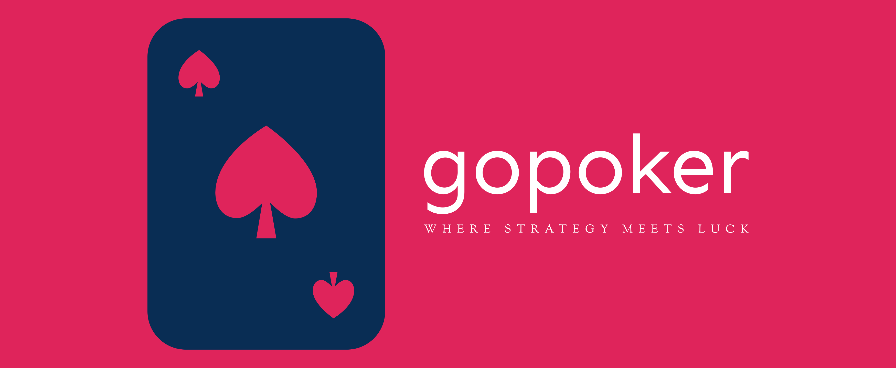

<p align="center">
    
</p>

👋 Hello! This is an app for playing a game of poker! It was created as an exercise in sniffing network traffic in an unsecured network but it turned out to be a full-fletched application for having some fun!

## ❤️ Getting started

Clone the repository:

```
git clone https://github.com/TypicalAM/gopoker
```

Run the backend:

```
cd backend
go run cmd/gopoker/gopoker.go
```

and the frontend:

```
cd frontend
npm start
```

You can now explore the page at `localhost:3000`

## Project purpose

This project was made for workshops at the Poznan University of Technology to show how easy it is to sniff unsecured network traffic. The page exchanges different sensitive pieces of information with the client (namely the username/password, a profile image and an ID image and credit card info [unsecured branch]). The unsecured branch is used for the purpose of widening the sensitive data range for easier sniffing. On the unsecure branch the game doesn't start until all the users have input their credit cards and they cannot join the queue if they don't have their IDs uploaded. After some time I decided to make it into a full project and remove the unsecure items from the core functionality.

## Technologies

This is my first adventure with front-end so the UI part isn't that impressive, the tech used is the following:
- ReactJS
- TailwindCSS
- Typescript

The backend is written in go with:
- Websocket communication between the client and the game server
- Sessions (via cookies)
- Routing and authentication
- Database support (gorm)

## TODO

Here are the things that I have not finished yet:
- [ ] Adding comments to texas_holdem.go
- [ ] Adding user profile image uploads 
- [ ] Tidying up the websocket logic (hub, client, game, state)
- [ ] A docker-compose to actually build the services
- [ ] Adding the unsecure credit card prompt (on the unsecure branch for the PUT security presentation)

## 📸 Here is a demo

Here is some basic usage:

<p align="center">
    
</p>

<p align="center">
    
</p>

